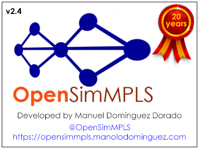

# PROJECT STATUS (needs Java 9 or later)

## Master branch

[](https://app.travis-ci.com/github/manolodd/opensimmpls/builds)

## Develop branch

[](https://app.travis-ci.com/github/manolodd/opensimmpls/builds)

# THE PROJECT



<b>OpenSimMPLS</b> stands out as a powerful MPLS network simulation tool, designed to be multiplatform and multilingual. Its user-friendly interface makes it an ideal resource for teaching and advanced research activities. Since its inception, it has been utilized to investigate new communication protocols, techniques, and methods related to MPLS and Quality of Service (GoS), as well as in studies on educational innovations across various disciplines. This mature project is employed by universities and companies in over 130 countries, becoming a cornerstone for teaching, research, and MPLS network design. Originally developed in 2004 as part of a research project at the University of Extremadura, OpenSimMPLS has significantly evolved, initially hosted on SourceForge.net and transitioning to a GIT repository on GitHub in 2014. Its established history and ongoing updates ensure its relevance in academic and professional fields, facilitating advancements in the study of modern networks.

It supports standard MPLS operation as well as GoS/MPLS operation. See "Guarantee of Service (GoS) Support Over MPLS using Active Techniques" proposal at http://opensimmpls.manolodominguez.com/content/common/pdf/documentation/gossobrempls.pdf

Here are some of the scientific works in which OpenSimMPLS has been essential:

1. Domínguez-Dorado, Manuel; González-Sánchez, José Luis. Soporte de Garantía de Servicio (GoS) sobre MPLS mediante Técnicas Activas. Proyecto/tesina para la obtención del título de Ingeniero en Informática. 2013, ISBN: 978-84-15927-19-8.
2. Domínguez-Dorado, Manuel; Rodríguez-Pérez, Franciso javier; González-Sánchez, José Luis. Guarantee of Service (GoS) support over MPLS using Active Techniques. Proceedings of the 4th WSEAS International Conference on Applied Informatics and Communications (AIC '04). Tenerife, SPAIN, 2004, ISBN: 960-8457-06-8.
3. Domínguez-Dorado, Manuel; Rodríguez-Pérez, Francisco Javier; González-Sánchez, José Luis; Marzo, José Luis; Gazo, Alfonso. An Architecture to provide Guarantee of Service (GoS) to MPLS. Proceedings of the IV Workshop in MPLS/GMPLS networks, Girona, SPAIN, 2005, ISBN: 84-934349-0-56.
4. Rodríguez-Pérez, Francisco Javier; Domínguez-Dorado, Manuel; González-Sánchez, José Luis; Marzo Lázaro, José Luis; Gazo-Cervero, Alfonso. OpenSimMPLS: Herramienta para la Innovación Docente e Investigación en Redes y Comunicaciones. Libro de actas de las V Jornadas de Ingeniería Telemática (JITEL'05) , Vigo, ESPAÑA, 2005. ISBN: 84-8408-346-2.
5. Domínguez-Dorado, Manuel; Rodríguez-Pérez, Francisco javier; González-Sánchez, José Luis; Gazo, Alfonso. Multiplatform and Opensource GoS/MPLS Simulator. Proceedings of the II European Modeling and Simulation Symposium (EMSS2006). International Mediterranean Modelling Multiconference (I3M2006), Barcelona, SPAIN, 2006, ISBN: 84-690-0726-2.
6. Domínguez-Dorado, Manuel; González-Sánchez, José-Luis; Carmona Murillo, Javier. Manual de usuario de OpenSimMPLS. Un enfoque práctico para la simulación de redes MPLS con Garantía de Servicio. 2011, ISBN: 978-84-614-7952-8.
7. Domínguez-Dorado, Manuel; Rodríguez-Pérez, Francisco Javier; González-Sánchez, José Luis. Guarantee of Service (GoS) support over MPLS using Active Techniques. WSEAS Transactions on Computers (WSEAS International Journal) , vol. 3, no 6, pp. 1959-1964, 2004, ISSN: 1109-2750.
8. Domínguez-Dorado, Manuel; Rodríguez-Pérez, Francisco Javier; González-Sánchez, José Luis. Simulador MPLS para la Innovación Pedagógica en el Área de Ingeniería Telemática. IEEE RITA. Revista Iberoamericana de Tecnologías del Aprendizaje. , vol. 2, no 1, pp. 27-34, 2007, ISSN: 1932-8540.
9. Domínguez-Dorado, Manuel; Rodríguez-Pérez, Francisco Javier; Carmona-Murillo, Javier; González-Sánchez, José Luis. Educational improvements applying an MPLS network simulator: a technical approach. IEEE MEEM. Multidisciplinary Engineering Education Magazine , vol. 2, no 4, pp. 18-25, 2007, ISSN: 1558-7908.

OpenSimMPLS and the mentioned works continue to be referenced in current international research.

In addition to the authors, others have also written about OpenSimMPLS. For instance:

1. Lucas J. González. Garantía de Servicio sobre MPLS: entrega garantizada. Linux Magazine nº56. Págs. 67-70. ISSN: 1576-4079. Enero, 2010.

Many individuals have produced content, such as YouTube videos, covering OpenSimMPLS, its usage, key features, and more:

https://www.youtube.com/results?search_query=opensimmpls

A quick search on the internet will yield a wealth of references to OpenSimMPLS, including instances where the simulator has been utilized, ready-to-use scenarios, presentations, and more.

https://www.google.com/search?q=opensimmpls

Anyway, please, refer always to the official project home page at:

 - https://opensimmpls.manolodominguez.com

# LICENSE

## Latest snapshot version being developed:

- <b>OpenSimMPLS 2.4-SNAPSHOT</b> (develop branch) - Apache-2.0.

## Binary releases:

- <b>OpenSimMPLS 2.3</b> (current, master branch) - Apache-2.0.
- <b>OpenSimMPLS 2.0 - 2.2</b> - Apache-2.0.
- <b>OpenSimMPLS 1.1</b> - GPLv3.0-or-later.
- <b>OpenSimMPLS 1.0</b> - GPLv2.0-or-later.

# PEOPLE BEHIND OPENSIMMPLS

## Author:
    
 - Manuel Domínguez-Dorado - <ingeniero@ManoloDominguez.com>

- Manuel Domínguez-Dorado - <ingeniero@ManoloDominguez.com>

## Other collaborators (only for release 1.0):

- Javier Carmona Murillo - <jcarmur@unex.es>

Please, refer always to the project home page at:

- http://opensimmpls.manolodominguez.com/

# COMPILING FROM SOURCES

The best option is to download the latest compiled stable releases from the releases section of this repository. However, if you want to test new features (please, do it and give feedback), you will need to compile the project from sources. Follow these steps:

- Clone the OpenSimMPLS repo:

```console
git clone https://github.com/manolodd/opensimmpls.git
```

- Compile the code and obtain a binary jar including all you need (you will need to install Maven before):

```console
cd opensimmpls
mvn package
```

- The jar file will be located in "target" directory.

```console
cd target
```

- Now, run the simulator:

```console
java -jar openSimMPLS-{YourVersion}-with-dependencies.jar
```

- Need some scenarios to try? That is not a problem!! You'll find them at the examples folder (root of your cloned repository). You can also download these examples, for your OpenSimMPLS version, in the Releases section of this repository.

# How to use OpenSimMPLS

You can open a quick start guide directly from the simulator GUI. However, you can find the same guide in some languages at https://github.com/manolodd/opensimmpls/tree/master/src/main/resources/com/manolodominguez/opensimmpls/resources/guides

# THIRD-PARTY COMPONENTS

OpenSimMPLS uses third-party components each one of them having its own OSS license. License compatibility has been taken into account to allow OpenSimMPLS be released under its current OSS licence. They are:

- Jfreechart 1.5.5 - LGPL - http://www.jfree.org/jfreechart
- slf4j-api 2.1.0-alpha1 - MIT - https://www.slf4j.org
- slf4j-simple 2.1.0-alpha1 - MIT - https://www.slf4j.org
- miglayout-swing 11.4.2 - BSD-3-clause - https://github.com/mikaelgrev/miglayout
- miglayout-core 11.4.2 - BSD-3-clause - https://github.com/mikaelgrev/miglayout
- AbsoluteLayout RELEASE230 - CDDL (Being replaced in OpenSimMPLS by miglayout)
- junit-jupiter-engine 5.8.2 - EPL-2.0 - https://junit.org/junit5

Thanks folks!

# HOW TO CONTRIBUTE

OpenSimMPLS is opensource software. I encourage you to modify it as much as possible; but I would like you to send this modifications back and, hence, become an OpenSimMPLS contributor. In this way, all the people will benefit from them as you are doing downloading and using OpenSimMPLS now.

If you want to contribute to OpenSimMPLS project, follow these instructions:

- Log in to your GitHub account.
- Look for OpenSimMPLS project.
- Select the <b>development branch</b> of OpenSimMPLS and create a fork in your own GitHub repository.
- Clone <b>your</b> OpenSimMPLS repository to your PC or laptop.
- Do all modifications in local, file additions or deletions, modifications, commits...
- Push your modifications to <b>your</b> remote GitHub OpenSimMPLS repository.
- Go again to your GitHub account, choose your OpenSimMPLS repository and click on the tab "Pull requests".
- Then, click on the green button at the right "New pull request". This will guide you to make a pull request (send your modifications on your own OpenSimMPLS repository to OpenSimMPLS main repository from where you did your fork at the beginning).
- Choose the development branch of manolodd/OpenSimMPLS as base branch to merge to. Then "Create pull request" (give a title and a description, please).
- That's all; I will have your contribution and I will try to merge it into the development branch of OpenSimMPLS. Please, comment your contribution as much as possible; I have to be able to understand your contribution.

REMEMBER!!!! all your contributions have to be compatible with Apache Software License 2.0 and you have to own all rights on them. And no source code contributions have to be compatible with Creative Commons..

# WHAT CAN YOU CONTRIBUTE?

A lot of things. Most people doesn't have the possibility to contribute code. But there are lots of other things that are very important too:

- Source code.
- Translations.
- Scenarios already designed.
- Teaching units. Lots of <b>OpenSimMPLS</b> users are university teachers. They use <b>OpenSimMPLS to teach network subjects</b>. If this is your case, share with everybody your teaching units: things you ask your students, exams, exercises based on <b>OpenSimMPLS</b>, and so on.
- Documentation. Independently of your native language, there is an <b>OpenSimMPLS</b> user that also has the same native language as you. It is not possible for me to documenting everything, but if you can do it, share it!
- Presentations.
- New icons and graphics art.
- Ideas.

#### Thanks for contributing.
